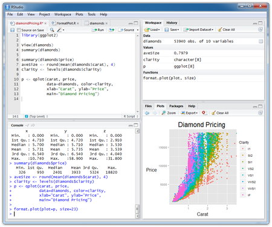

```{r setup, include=FALSE}
knitr::opts_chunk$set(echo = FALSE)
```

## Calificaciones

<center>
```{r, out.width="300px", out.height="150px"}
knitr::include_graphics("imagenes/calificaciones.jpg")
```
</center>

## Código de Honor
- Ser honesto: no copiar, plagiar ni mentir en ninguna Forma
- Está prohibido llorar

\centering
```{r, out.width="150px", out.height="150px"}
knitr::include_graphics("imagenes/ruego.jpg")
```


## Edmodo
- www.edmodo.com 

- Tutorial: https://www.youtube.com/watch?v=oMJcBjzJwiI

**POR FAVOR : PONER NOMBRES NO SEUDÓNIMOS**

- GRUPO #5 (Jueves) :   nn7w6x


## Syllabus 1

<center>
```{r, out.width="300px", out.height="200px"}
knitr::include_graphics("imagenes/syllabus1.jpg")
```
</center>

## Syllabus 2

<center>
```{r, out.width="300px", out.height="200px"}
knitr::include_graphics("imagenes/syllabus2.jpg")
```
</center>

## Syllabus 3

<center>
```{r, out.width="300px", out.height="200px"}
knitr::include_graphics("imagenes/syllabus3.jpg")
```
</center>

## Objetivos

- Estadística Descriptiva: Sistematización del dato hasta convertirlo en información, sin intervención de medida probabilística

- Técnicas de conteo y revisión de funciones que evalúan conjuntos.

- Estadística Inferencial: enfatizado en construcción de intervalos de confianza, contrastes de hipótesis estadísticas aplicados a técnicas como bondad ajustes, tabla de contingencia, anova y modelos de regresión lineal

## Bibliografía

\begin{alertblock}{Estadística. Décima edición}
TRIOLA, MARIO F.
PEARSON EDUCACI??N, M??xico, 2009
ISBN: 978-970-26-1287-2
\end{alertblock}

\begin{alertblock}{ESTADíSTICA PARA INGENIEROS}
William Navidi
McGRAW-HILL/INTERAMERICANA EDITORES, S.A. DE C.V.
ISBN 970-10-5629-9
\end{alertblock}

\begin{alertblock}{R para Principiantes}
Emmanuel Paradis
Institut des Sciences 
Universit Montpellier II
F-34095 Montpellier cdex 05
France
\end{alertblock}

\begin{alertblock}{Probabilidad y Estadística, Fundamentos y Aplicaciones}
Segunda Edición
Gaudencio Zurita
\end{alertblock}

## software

\begin{columns}
\column{0.75\textwidth}
```{r, out.width="200px", out.height="200px"}

```

\column{0.25\textwidth}

```{r, out.width="50px", out.height="50px"}
knitr::include_graphics("imagenes/RStudio-Ball.png")
```
\end{columns}

- https://www.youtube.com/watch?v=1WXgaa2Spp0


## Introducción

1. En estadística tratamos con datos, esto es, con una cantidad N de mediciones procesadas, sean estas numéricas(cuantitativas) o categóricas (cualitativas).
2. Un principio extremadamente importante en la estadística en general, es que el método que se utiliza para reunir datos de muestras puede construir o destruir la validez de las conclusiones basadas en los datos.
    * Hay datos de muestras que son útiles porque describen de manera exacta características importantes de poblaciones
    * Hay datos muestrales recolectados de tal forma que condenan los resultados a la creciente pila de basura de la mala información.
3. Utilizar los datos muestrales para obtener conclusiones sobre poblaciones.
4. Los métodos de la estadística permiten que los científicos e ingenieros diseñen experimentos válidos y obtengan conclusiones confiables a partir de datos obtenidos.


## Introducción - Definiciones

- Es un conjunto de métodos para planear estudios y experimentos,
obtener datos y luego organizar, resumir, presentar, analizar, interpretar
y llegar a conclusiones basadas en los datos.

- En estadística se trata principalmente de utilizar datos muestrales para hacer inferencias (o generalizaciones) sobre una población completa. Por tal razón se debe saber y entender las definiciones de datos, población, muestra, censo, parámetro y estadístico, ya que son básicas y fundamentales.


## Introducción - Definiciones

### Datos
Son las observaciones recolectadas (como mediciones, géneros, respuestas de encuestas).

### Población N
Es el conjunto completo de todos los elementos (puntuaciones,
personas, medidas, etcétera) que se va estudiar. El conjunto es completo porque
incluye a todos los sujetos que se estudiarán.

### Muestra n
Es un subconjunto de miembros seleccionados de una población. $N>n$


## Introducción - Definiciones

### Censo 
Es el conjunto de datos de cada uno de los miembros de la población.

### Parámetro 
Es una medición numérica que describe algunas características de
una población.

### Estadístico 
Es una medición numérica que describe algunas características
de una muestra.


##  Ejemplos - Definiciones
A cinco estudiantes de educación superior se les pregunta en cuántos semestres, a partir del momento de la entrevista, estiman que van a graduarse; **especifique la muestra si lo que se obtiene como respuesta es: siete, cinco, ocho, cinco y cuatro semestres??**

Desarrollo:

$n=5$ y $X_1=7; X_2=5; X_3=8; X_4=5; X_5=4;$

La muestra es:

$\mathbf{x}^T=(X_1,X_2,X_3,X_4,X_5) = (7,5,8,5,4)$


##  Ejemplos - Definiciones

Una encuesta preguntá a 1087 adultos: Consume usted bebidas
alcohólicas como licor, vino o cerveza, o es totalmente abstemio?

**Población o Muestra???** 


## Ejemplos - Definiciones

- En la ciudad de Nueva York hay 3250 botones para caminar,
que los peatones emplean en las intersecciones de tránsito. Se descubrió
que el 77% de dichos botones no funciona (según datos del artículo "For
Exercise in New York Futility, Push Button"", de Michael Luo, New York Times). 


**La cifra del 77% es un parámetro o un estadístico??**

- Con base en una muestra de 877 ejecutivos encuestados, se encontr??
que el 45% de ellos no contratar??a a alguien con un error ortogr??fico en
su solicitud de empleo. 

**La cifra del 45% es un parámetro o un estadístico??**


## Tipos de Datos

### Cuantitativos
Consisten en números que representan conteos o mediciones. Ej: Los pesos de las supermodelos

### Cualitativos o categóricos o de atributo
Se dividen en diferentes categorías que se distinguen por algunas características no numéricas. Ej: El género (hombre/mujer) de atletas profesionales.


## Datos Cuantitativos

### Datos discretos
El número de valores posibles, es un número finito o un número que puede contarse (es decir, el número de valores posibles es 0, 1, 2, etcétera).

### Datos continuos (numéricos)
Resultan de un infinito de posibles valores que corresponden a alguna escala continua que cubre un rango de valores sin huecos, interrupciones o saltos.

### Ejemplos

- El número de latas de bebidas de cola son datos discretos
- El volumen real de la bebida de cola es un dato continuo


## Otra forma de clasificar los datos

Consiste en usar cuatro niveles de medición: nominal, ordinal, de intervalo y de razón. Cuando se aplica la estadística a problemas reales, el nivel de medición de los datos es un factor importante para determinar el procedimiento a utilizar

\begin{alertblock}{NOTA}
Lo importante aquí se basa en el sentido común: no hay que hacer
cálculos ni utilizar métodos estadísticos que no sean apropiados para los datos.
Por ejemplo, no tendría sentido calcular un promedio de los números que aparecen en las camisetas de los jugadores de básquetbol.
\end{alertblock}

## Nivel de medición de datos

<center>
```{r, out.width="300px", out.height="200px"}
knitr::include_graphics("imagenes/mediciondedatos.jpg")
```
</center>

## Nivel de medición de datos - Ejemplos

- Si/no/indeciso: Respuestas de sí, no e indeciso en una encuesta - **Nominal**

- Colores: Los colores de los automóviles conducidos por estudiantes universitarios
(rojo, negro, azul, blanco, magenta) **Nominal**

- Las calificaciones de un curso: Un profesor universitario asigna calificaciones
de A, B, C, D, E o F. Tales calificaciones se pueden ordenar no es posible determinar diferencias entre tales calificaciones. Por ejemplo, sabemos que A es mayor que B (por lo que hay un orden); pero no podemos restar B de A (por lo que no se puede calcular la diferencia) **Ordinal**

- Años: Los años 1000, 2008, 1776 y 1492. (El tiempo no inició en el año 0,
por lo que el año 0 es arbitrario y no constituye un punto de partida cero natural
que represente "la ausencia de tiempo) **De intervalo**

- Precios: Los precios de libros de texto universitarios ($0 realmente representa
ningún costo y un libro de $90 es tres veces más caro que un libro
de $30). **De razón**

