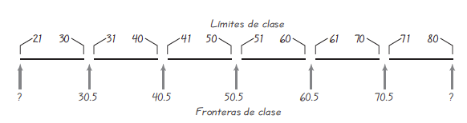

```{r setup, include=FALSE}
knitr::opts_chunk$set(echo = FALSE)
```

## Características importantes de los datos (I)
\begin{enumerate}
\item \textbf{Centro:} Valor promedio o representativo que indica la localización de la mitad del conjunto de los datos.
\item \textbf{Variación:} Medida de la cantidad en que los valores de los datos varían entre sí.
\item \textbf{Distribución:} La naturaleza o forma de la distribución de los datos (como en forma de campana, uniforme o sesgada).
\item \textbf{Valores extremos:} Valores muestrales que están muy alejados de la vasta mayoría de los demás valores de la muestra.
\item \textbf{Tiempo:} Características cambiantes de los datos a través del tiempo.
\end{enumerate}

## Distribución de frecuencias (I)

### Definición
Una distribución de frecuencias (o tabla de frecuencias) lista valores de los datos (ya sea de manera individual o por grupos de intervalos), junto con sus frecuencias (o conteos) correspondientes.

\centering
```{r, out.width="150px", out.height="160px"}

```

## Distribución de frecuencias (II)

### Definiciones
 - Los **límites de clase inferiores** son las cifras más pequeñas que pueden
pertenecer a las diferentes clases. 
-  Los **límites de clase superiores** son las cifras más grandes que pueden
pertenecer a las diferentes clases. 
-  Las **fronteras de clase** son las cifras que se utilizan para separar las clases,
pero sin los espacios creados por los límites de clase. 
- Las **fronteras de clase** son muy útiles en la siguiente cuando elaboremos una gráfica 
llamada histograma.
- Las **marcas de clase** son los puntos medios de las clases. Las marcas
de clase se calculan sumando el límite de clase inferior con el límite de
clase superior, y dividiendo la suma entre 2.
- La **anchura de clase** es la diferencia entre dos límites de clase inferiores
consecutivos o dos fronteras de clase inferiores consecutivas. 

## Distribución de frecuencias (III)

\centering
```{r, out.width="130px", out.height="130px"}

```

\centering
```{r, out.width="250px", out.height="80px"}

```

## Procedimiento para construir una distribución de frecuencias (I)

1. Es posible resumir conjuntos grandes de datos 
2. Se logra cierta comprensión sobre la naturaleza de los datos 
3. Se tiene una base para construir gráficas importantes, como por ejemplo los histogramas

### EJEMPLO Edades de las mejores actrices 
Use las edades de las mejores actrices de la tabla para construir la
distribución de frecuencias. Suponga que desea incluir 6 clases.

### SOLUCIÓN (I)

**Paso 1:** Comience seleccionando 6 clases.


**Paso 2:** Calcule la anchura de clase. 


## Procedimiento para construir una distribución de frecuencias (II)

\begin{equation}
\begin{aligned}
Anchura \approx \frac{\ (valor \ más \ alto) \ - (valor \ más \ bajo)}{número \ de \ clases} \\ =\frac{80-21}{6}=9.833\approx 10 
\end{aligned}
\end{equation}

**Paso 3:** Elegimos un punto de partida de 21, que es el valor más bajo
de la lista y un número conveniente

**Paso 4:** Sume la anchura de clase 10 al punto de partida 21 para determinar
que el segundo límite inferior de clase es igual a 31. Continúe y sume
la anchura de clase 10 para obtener los límites inferiores de clase
restantes de 41, 51, 61 y 71.

**Paso 5:** Liste los límites de clase inferiores de forma vertical, como se muestra
al margen. Con esta lista podemos identificar con facilidad los límites
de clases superiores correspondientes, que son 30, 40, 50, 60, 70 y 80.

**Paso 6:** Después de identificar los límites inferiores y superiores de cada clase,
proceda a trabajar con el conjunto de datos asignando una marca a cada
valor. Una vez completadas las marcas, súmelas para obtener las frecuencias.

## Distribución de frecuencias relativas

Una distribución de frecuencias relativas incluye los mismos límites de clase que una distribución de frecuencias, pero utiliza las frecuencias relativas en vez de las frecuencias reales.

\begin{equation}
frecuencia \ relativa \ = \frac{\ frecuencia \ de \ clase}{suma \ de \ todas \ las \ frecuencias} 
\end{equation}

\centering
```{r, out.width="80px", out.height="120px"}

```

## Distribución de frecuencias acumulativas

La frecuencia acumulativa de una clase es la suma de las frecuencias para esa clase y todas las clases anteriores.

\centering
```{r, out.width="80px", out.height="120px"}

```

##  Distribución normal

Una característica fundamental de una distribución normal es que, cuando se grafica, el resultado tiene
forma de “campana”; y al inicio las frecuencias son bajas, luego se incrementan hasta un punto máximo y luego disminuyen.

\centering
```{r, out.width="150px", out.height="120px"}

```

## Histogramas Normal 

Una característica fundamental de una distribución normal es que, cuando se grafica en un histograma, el
resultado es una curva en forma de “campana”, como en el histograma de la figura.
Las principales características de la curva en forma de campana son 

1. el aumento de las frecuencias, las cuales alcanzan un
punto máximo y luego disminuyen; 

2. la simetría, donde la mitad izquierda de la
gráfica es casi una imagen en espejo de la mitad derecha.

\centering
```{r, out.width="230px", out.height="120px"}

```


## Distribución de frecuencias 

\begin{columns}
\column{0.5\textwidth}
\centering

```{r, out.width="80px", out.height="120px"}

```

\column{0.5\textwidth}
\centering
```{r, out.width="80px", out.height="120px"}

```
\end{columns}

## Histogramas

### Definición
Un histograma es una gráfica de barras donde la escala horizontal representa
clases de valores de datos y la escala vertical representa frecuencias. Las
alturas de las barras corresponden a los valores de frecuencia; en tanto que
las barras se dibujan de manera adyacente (sin huecos entre sí).

\centering
```{r, out.width="230px", out.height="120px"}

```

## Histogramas en R (I)

```{r RR1, fig.height = 3, fig.width = 3, fig.align = "center", echo = TRUE}
x=c(3,2,5,1,3,1,5,6,2,2,2,1,3,5,2)# ingresar un vector cualquiera
table(x)# calcula frecuencia absoluta
table(x)[4]# accedo a la cuarta entrada o cuarto nivel del vector x
sum(table(x))#sumo todos los elementos
```

## Histogramas en R (II)

```{r RR2, fig.height = 3, fig.width = 3, fig.align = "center", echo = TRUE}
x=c(3,2,5,1,3,1,5,6,2,2,2,1,3,5,2)# ingresar un vector cualquiera
prop.table(table(x))#frecuencias relativas
cumsum(table(x))# suma acumulativa
```

## Histogramas en R (III)

```{r RR3, fig.height = 3, fig.width = 3, fig.align = "center", echo = TRUE}
hist(x, main="Histogram ",xlab="x", 
     ylab="frecuencias",border="blue", 
     col="green",breaks = c(0:6))
```

## Histogramas en R (IV)
```{r RR4, fig.height = 3, fig.width = 3, fig.align = "center", echo = TRUE}
#cargar datos a partir de una hoja de excel
library(readxl)
calificacion=read_excel("/Users/Gustavo/AnacondaProjects/R_projects/Presentaciones/estadisticaI/tercera/imagenes/calificacion.xlsx", sheet = 1)
table(calificacion$notas)#frecuencias absolutas 
prop.table(table(calificacion$notas))#frecuencias relativas
```

## Histogramas en R (IV)
```{r RR5, fig.height = 3, fig.width = 3, fig.align = "center", echo = TRUE}
x=calificacion$notas
hist(x, main="Histogram ",xlab="x", 
     ylab="frecuencias",border="blue", 
     xlim= c(1,10),
     col="green")
```

## Polígono de frecuencias absolutas
```{r RR6, fig.height = 3, fig.width = 3, fig.align = "center", echo = TRUE}
x=calificacion$notas
h=hist(x, main=" ",xlab="x", 
     ylab="frecuencias",border="blue", 
     xlim= c(0,10),right = F,
     col="green")
par(new=TRUE)
lines(h$mids, h$counts, type = "b", pch = 20, col = "red", lwd = 3)
```

## Polígono de frecuencias relativas
```{r RR7, fig.height = 3, fig.width = 3, fig.align = "center", echo = FALSE, eval = TRUE}
x=calificacion$notas
h=hist(x, main=" ",xlab="x", 
     ylab="frecuencias",border="blue", 
     xlim= c(0,10),right = F,freq=FALSE,
     col="green")
par(new=TRUE)
plot(h$mids, h$density, main="Polígono de Frecuencias ",xlab="x",type="b",ylab="", 
     xlim= c(0,10),ylim=c(0,max(h$density)),
     col="blue")
```

## Ojiva
```{r RR8, fig.height = 3, fig.width = 3, fig.align = "center", echo = TRUE, eval = TRUE}
x=calificacion$notas
plot(h$breaks,cumsum(table(x)), main="Ojiva",xlab="x",type="b",
     ylab="",xlim= c(0,10),ylim=c(0,max(cumsum(table(x)))),
     col="red")
```

## Gráfico circulares
```{r RR9, fig.height = 3, fig.width = 3, fig.align = "center", echo = TRUE, eval = TRUE}
slices = c(10, 12,4, 16, 8)
lbls = c("US", "UK", "Australia", "Alemania", "Francia")
pct = round(slices/sum(slices)*100)
lbls = paste(lbls, pct) # anadir porcentaje 
lbls = paste(lbls,"%",sep="") # ad % to labels 
pie(slices,labels = lbls, col=rainbow(length(lbls)),
  	main="Gráfico circulares")
```

## Gráfico circulares 3D
```{r RR10, fig.height = 3, fig.width = 3, fig.align = "center", echo = TRUE, eval = TRUE}
library(plotrix)
slices <- c(10, 12, 4, 16, 8) 
lbls <- c("US", "UK", "Australia", "Germany", "France")
pie3D(slices,labels=lbls,explode=0.5,
  	main="Gráfico circulares 3D")
```

## Características importantes de los datos 
\begin{enumerate}
\item \textbf{Centro:} Valor promedio o representativo que indica la localización de la mitad del conjunto de los datos.
\item \textbf{Variación:} Medida de la cantidad en que los valores de los datos varían entre sí.
\item \textbf{Distribución:} La naturaleza o forma de la distribución de los datos (como en forma de campana, uniforme o sesgada).
\item \textbf{Valores extremos:} Valores muestrales que están muy alejados de la vasta mayoría de los demás valores de la muestra.
\item \textbf{Tiempo:} Características cambiantes de los datos a través del tiempo.
\end{enumerate}


## Medidas de tendencia central
\centering
```{r, out.width="380px", out.height="160px"}

```

## EJEMPLO Calcule 

- A continuación se presenta una lista de cantidades de plomo (medidas en en el aire. Calcule
la mediana de esta muestra. 5.40 1.10 0.42 0.73 0.48 1.10

- Las modas de los siguientes conjuntos de datos:
a. 5.40 1.10 0.42 0.73 0.48 1.10
b. 27 27 27 55 55 55 88 88 99
c. 1 2 3 6 7 8 9 10

- Identifique una razón importante por la que, la media y la mediana no son estadísticos que puedan servir de manera precisa y efectiva como medidas de tendencia central.

a. Códigos postales: 12601 90210 02116 76177 19102


## La media de una distribución de frecuencias
\centering
```{r, out.width="280px", out.height="180px"}

```

## La mejor medida de tendencia central

```{r, out.width="280px", out.height="180px"}

```


## Sesgo
Una distribución de datos está sesgada si no es simétrica y se extiende más
hacia un lado que hacia el otro. (Una distribución de datos es simétrica si la
mitad izquierda de su histograma es aproximadamente una imagen en espejo
de su mitad derecha).
\centering
```{r, out.width="250px", out.height="130px"}

```

## Ejercicios

\begin{columns}
\column{0.5\textwidth}

\centering
```{r, out.width="80px", out.height="120px"}

```

\column{0.5\textwidth}
\centering
```{r, out.width="80px", out.height="120px"}

```
\end{columns}

## Ejemplo

\centering
```{r, out.width="280px", out.height="180px"}

```


