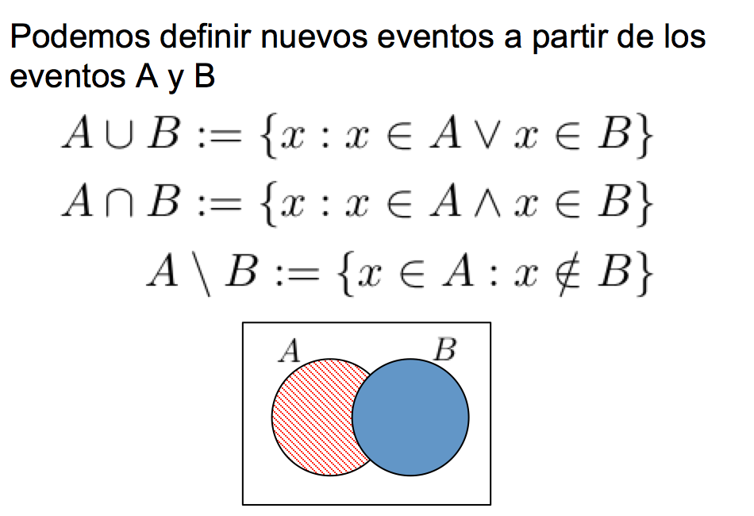
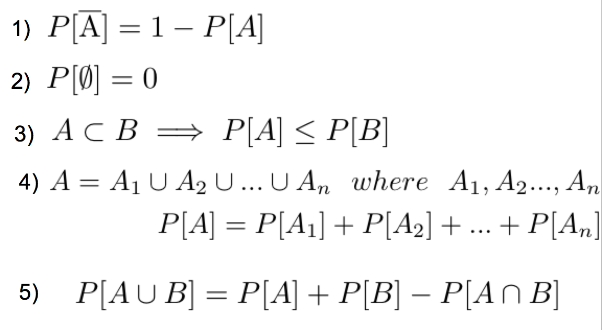

```{r setup, include=FALSE}
knitr::opts_chunk$set(echo = FALSE)
```

## Calificaciones

<center>
```{r, out.width="300px", out.height="150px"}
knitr::include_graphics("imagenes/calificaciones.jpg")
```
</center>

## Código de Honor
- Ser honesto: no copiar, plagiar ni mentir en ninguna Forma
- Está prohibido llorar

<center>
```{r, out.width="150px", out.height="150px"}
knitr::include_graphics("imagenes/ruego.jpg")
```
</center>

## Edmodo
- www.edmodo.com 

- Tutorial: https://www.youtube.com/watch?v=oMJcBjzJwiI

**POR FAVOR : PONER NOMBRES NO SEUDÓNIMOS**

- GRUPO #5 (Martes) :  c9j9wj 

- GRUPO #4 (Miércoles) :   rnz279

## Syllabus 1

\centering
```{r, out.width="300px", out.height="200px"}
knitr::include_graphics("imagenes/syllabus1.jpg")
```

## Syllabus 2

\centering
```{r, out.width="300px", out.height="200px"}
knitr::include_graphics("imagenes/syllabus2.jpg")
```

## Syllabus 3

\centering
```{r, out.width="300px", out.height="200px"}
knitr::include_graphics("imagenes/syllabus3.jpg")
```

## Syllabus 4

\centering
```{r, out.width="300px", out.height="200px"}
knitr::include_graphics("imagenes/syllabus4.jpg")
```

## Bibliografía

\begin{alertblock}{Estadística. Décima edición}
TRIOLA, MARIO F.
PEARSON EDUCACIÓN, México, 2009
ISBN: 978-970-26-1287-2
Área: Matemáticas
\end{alertblock}

\begin{alertblock}{ESTADÍSTICA PARA INGENIEROS}
William Navidi
McGRAW-HILL/INTERAMERICANA EDITORES, S.A. DE C.V.
ISBN 970-10-5629-9
\end{alertblock}

\begin{alertblock}{R para Principiantes}
Emmanuel Paradis
Institut des Sciences de l’E´volution
Universit Montpellier II
F-34095 Montpellier cdex 05
France
\end{alertblock}

\begin{alertblock}{Probabilidad y Estadística, Fundamentos y Aplicaciones}
Segunda Edición
Gaudencio Zurita
\end{alertblock}

## software

\begin{columns}
\column{0.75\textwidth}
```{r, out.width="200px", out.height="200px"}
knitr::include_graphics("imagenes/rstudio-windows.png")
```

\column{0.25\textwidth}

```{r, out.width="50px", out.height="50px"}
knitr::include_graphics("imagenes/RStudio-Ball.png")
```
\end{columns}

- https://www.youtube.com/watch?v=1WXgaa2Spp0


## Objetivos

- La inferencia estadística consiste en extraer una muestra de una población y analizar sus datos
con el propósito de aprender acerca de ello.

- Estadística Inferencial: enfatizado en construcción de intervalos de confianza, contrastes de hipótesis estadísticas aplicados a técnicas como bondad ajustes, tabla de contingencia, anova y modelos de regresión lineal.

- Comprobar enunciados respecto de grandes conjuntos de datos, en base a un subconjunto pequeño de los mismos.


## Ejemplo Ilustrativo

**Considere una máquina que hace varillas de acero para su uso en dispositivos ópticos de almacenamiento. La especificación del diámetro de las varillas es** $0.45\pm0.02$ **cm. En la última hora, la máquina ha hecho mil varillas. El ingeniero que supervisa la calidad quiere saber cuántas de estas varillas satisfacen la especificación. No tiene tiempo para medir todas. Toma una muestra aleatoria de 50 varillas, las mide y encuentra que 46 de éstas (92%) satisfacen la especificación del diámetro**

- no es probable que la muestra de 50 varillas represente perfectamente a la población de mil??

- La proporción de buenas varillas en la población probablemente es un poco diferente que la proporción de la muestra de 92%.?

- ¿es admisible que los porcentajes de población sean superiores a 95%? ¿y de 98%? ¿O menores de 90%?, ¿o de 85%?


## Introducción - Definiciones

### Datos
Son las observaciones recolectadas (como mediciones, géneros, respuestas de encuestas).

### Población N
Es el conjunto completo de todos los elementos (puntuaciones,
personas, medidas, etcétera) que se va estudiar. El conjunto es completo porque
incluye a todos los sujetos que se estudiarán.

### Muestra n
Es un subconjunto de miembros seleccionados de una población. $N>n$


## Introducción - Definiciones

### Censo 
Es el conjunto de datos de cada uno de los miembros de la población.

### Parámetro 
Es una medición numérica que describe algunas características de
una población.

### Estadístico 
Es una medición numérica que describe algunas características
de una muestra.

## Población y muestra

\centering
```{r, out.width="300px", out.height="200px"}

```


## Muestreo 

**"Existen tres clases de mentiras: mentiras, viles mentiras y estadísticas". Se ha dicho que "las cifras no mienten, pero los mentirosos también usan cifras"**

- Los datos muestrales deben reunirse de una forma adecuada, como a
través de un proceso de selección aleatoria.

- Si los datos muestrales no se reúnen de forma apropiada, resultarán tan
inútiles que ninguna cantidad de tortura estadística podrá salvarlos.

- Una muestra aleatoria simple de tamaño n es una muestra elegida por un método en el que cada colección de n elementos de la población tiene la misma probabilidad de formar la muestra, de la misma manera que en una lotería.


## Muestras aleatorias simples (I)

**Un nuevo proceso químico se realiza diez veces cada mañana durante cinco días consecutivos. Una gráfica de los resultados en el orden en que aparecieron no presenta ningún patrón o tendencia obvia. Si el nuevo proceso se pone en producción, haciéndolo funcionar diez horas todos los días, desde las 7 a.m. hasta las 5 p.m. ¿Es razonable considerar que los 50 resultados sean una muestra aleatoria simple? ¿Qué ocurre si el proceso está siempre funcionando por la mañana?**

<!--  Debido a que se intenta poner en funcionamiento el nuevo proceso tanto durante la mañana
como en la tarde, la población consta de todos los resultados que alguna vez se observarán,
incluyendo tanto las realizaciones por la mañana como por la tarde. La muestra se toma sólo
de la parte de la población de los resultados matutinos; por tanto, no es una muestra aleatoria
simple. Hay muchas cosas que podrían estar equivocadas si esto se usa como una muestra
aleatoria simple. Por ejemplo, las temperaturas ambientales pueden ser diferentes entre la mañana
y la tarde, ello podría afectar los resultados.
Si el proceso funcionara sólo por la mañana, entonces la población constaría sólo de resultados
matutinos. Debido a que la muestra no presenta ningún patrón o tendencia obvia,
bien podría ser apropiado considerarla como muestra aleatoria simple. --> 

## Muestras aleatorias simples (II)

**Un ingeniero civil acaba de recibir una remesa de mil bloques de hormigón, que pesan aproximadamente 50 libras cada uno. Los bloques se han entregado en una gran pila. El ingeniero quiere investigar la fuerza de compresión de los bloques midiendo las fuerzas en una muestra de diez bloques. Para tomar una muestra aleatoria simple se requeriría sacar bloques del centro y de la parte inferior de la pila, lo que puede ser muy difícil. Por esta razón, el ingeniero puede tomar una muestra simplemente tomando diez bloques de la parte superior de la pila.**

 <!--  Para tomar una muestra aleatoria simple se requeriría sacar bloques del centro y de la parte inferior
de la pila, lo que puede ser muy difícil. Por esta razón, el ingeniero puede tomar una muestra
simplemente tomando diez bloques de la parte superior de la pila. Una muestra así se llama
muestra de conveniencia. --> 


## Muestras aleatorias simples (III)

**Un inspector de calidad prueba 40 pernos de una gran remesa y mide la longitud de cada uno. Descubre que 34 de ellos (85%) cubre la especificación de longitud. Llega entonces a la conclusión de que exactamente 85% de los pernos de la remesa satisfacen la especificación. Por otra parte, el supervisor del inspector concluye que la proporción de pernos buenos está cerca de 85% con cierta probabilidad, pero que no es exactamente igual. ¿Cuál es la conclusión correcta?**

<!-- Debido a la variación del muestreo, las muestras aleatorias simples no reflejan a la población
perfectamente. Sin embargo, con frecuencia están bastante cerca. Por tanto, resulta adecuado
inferir que la proporción de pernos buenos en la remesa esté cerca de la proporción de muestra,
que es de 85%, con cierta probabilidad. Sin embargo, no es probable que la proporción
de población sea igual a 85 por ciento.  --> 


## Errores de muestreo

No importa lo bien que usted planee y ejecute el proceso de recolección de muestras, es probable que ocurra algún error en los resultados. Por ejemplo, seleccione 1000 adultos al azar, pregúnteles si se graduaron de bachillerato y registre el porcentaje de respuestas afirmativas en la muestra. Si usted elige otra muestra de 1000 adultos al azar, es probable que obtenga un porcentaje diferente en esa muestra. Esto se conoce como **variación del muestreo**

- Un **error de muestreo** es la diferencia entre el resultado de una muestra y el
verdadero resultado de la población; este error es consecuencia de las fluctuaciones
por el azar.


- Un **error que no es de muestreo** sucede cuando los datos muestrales se obtienen,
registran o analizan de forma incorrecta (como cuando se selecciona
una muestra sesgada, cuando se usa un instrumento de medición defectuoso
o cuando se copian los datos de forma incorrecta).

## Conceptos básicos de Probabilidades

### Experimento
Proceso de prueba y observación

### Experimento aleatorio
No se conoce el resultado del experimento

### Espacio muestral $\Omega$
Espacio muestral del experimento que se denota con $\Omega$

### Puntos de la muestra
Son los valores de los experimentos y pertenecen al espacio muestral 
$\Omega=\{w_1,w_2,w_3,...w_n\}$

### Evento
Es un subconjunto del espacio muestral

## Experimento - Ejemplo (I)

\begin{columns}
\column{0.25\textwidth}
Lanzar un dado

- $\Omega=\{1,2,3,4,5,6\}$  

- Eventos???

- $E_1=\{2,4,6\}$ 

- $E_2=\{1,3\}$

\column{0.75\textwidth}
\centering
```{r, out.width="180px", out.height="150px"}

```
\end{columns}


## Experimento - Ejemplo (II)

\centering
```{r, out.width="300px", out.height="200px"}

```


## Probabilidad
\centering
```{r, out.width="250px", out.height="200px"}

```

## Axioma de Probabilidades

Los axiomas de probabilidad son las condiciones mínimas que deben verificarse para que una función definida sobre un conjunto de sucesos determine consistentemente sus probabilidades. Fueron formulados por Kolmogórov en 1933.

\centering
```{r, out.width="200px", out.height="100px"}

```

## Eventos mutuamente excluyentes

\centering
```{r, out.width="250px", out.height="180px"}

```

## Espacio de Probabilidades

\centering
```{r, out.width="250px", out.height="180px"}

```

## Probabilidad condicional

\centering
```{r, out.width="250px", out.height="150px"}

```


## Eventos Independientes (I)
Se dice que dos eventos, A y B, son independentiens si y sólo si la probabilidad del evento B no esta influenciada o cambiada por el suceso A, o viceversa.

\centering
```{r, out.width="250px", out.height="100px"}

```

## Eventos Independientes (II)

\centering
```{r, out.width="330px", out.height="200px"}

```

## Probabilidad total y Teorema de Bayes
\centering
```{r, out.width="330px", out.height="200px"}

```

## Probabilidad - Ejemplos
Calcule lo siguiente a partir de la tabla:

\centering
```{r, out.width="200px", out.height="100px"}

```

-  Si se elige al azar a uno de los 300 sujetos de prueba, calcule la probabilidad
de que la persona resulte positiva, dado que en realidad consumió
marihuana.


- Si se elige al azar a uno de los 300 sujetos de prueba, calcule la probabilidad
de que la persona realmente haya consumido marihuana, dado que tuvo un
resultado de prueba positivo

## Probabilidad - Respuesta

\centering
```{r, out.width="200px", out.height="50px"}

```

\centering
```{r, out.width="200px", out.height="50px"}

```


