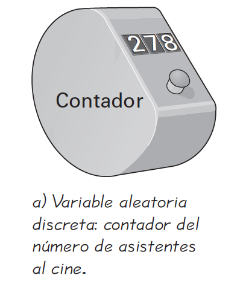
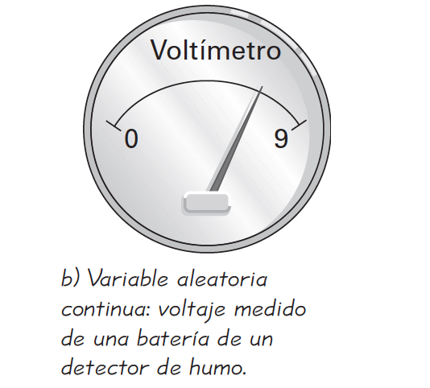
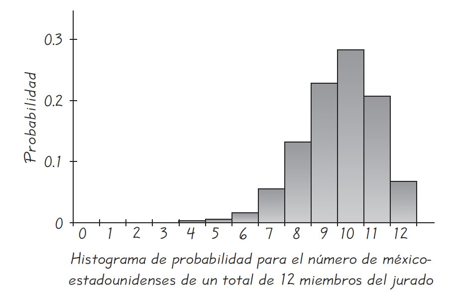
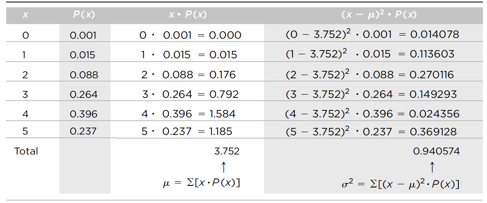

   
```{r setup, include=FALSE}
knitr::opts_chunk$set(echo = FALSE)
```

## Variables Aleatorias (I)

\centering
```{r, out.width="250px", out.height="150px"}
knitr::include_graphics("imagenes/aleatorio.jpg")
```

## Variables Aleatorias (II)
**Definiciones**

- Una **variable aleatoria** es aquella (casi siempre representada por X) que tiene un solo valor numérico determinado por el azar, para cada resultado de un procedimiento.

- Una **distribución de probabilidad** es una distribución que indica la probabilidad de cada valor de la variable aleatoria. A menudo se expresa como gráfica, tabla o fórmula.


## Variables Aleatorias (III)

\centering
```{r, out.width="250px", out.height="120px"}
knitr::include_graphics("imagenes/aleatorio1.jpg")
```

## Probabilidades - Variables Aleatorias (I)

\centering
```{r, out.width="280px", out.height="120px"}
knitr::include_graphics("imagenes/probabilidad1.jpg")
```

## Probabilidades - Variables Aleatorias (II)
Lanzo una moneda 3 veces. cuál es la probabilidad que salgan 2 caras, cuál es la probabilidad que salgan 1 caras, cuál es la probabilidad que salgan 0 caras?

```{r cars, echo = TRUE}
dbinom(x=2, size=3, prob=1/2)
dbinom(x=1, size=3, prob=1/2)
dbinom(x=0, size=3, prob=1/2)
```


## Clasificación de las Variables aleatorias

**Definiciones**

- Una **variable aleatoria discreta** tiene un número finito de valores o un número de valores contable, donde "contable" se refiere al hecho de que podría haber un número infinito de valores, pero que pueden asociarse con un proceso de conteo.

- Una **variable aleatoria continua** tiene un número infinito de valores, y esos valores pueden asociarse con mediciones en una escala continua, de manera que no existan huecos o interrupciones.


## Ejemplo de las Variables aleatorias (I)

\begin{columns}
\column{0.5\textwidth}

\centering
```{r, out.width="150px", out.height="110px"}

```

\column{0.5\textwidth}
\centering
```{r, out.width="150px", out.height="110px"}

```
\end{columns}


## Ejemplo de las Variables aleatorias (II)

- Sea x $=$ número de huevos que una gallina pone en un día.

- La medida del voltaje de una batería de un detector de humo puede ser cualquier valor entre 0 y 9 volts

- El conteo del número de estudiantes de estadística que asisten a clase

- Sea x $=$ cantidad de leche que produce una vaca en un día


##  Requisitos de una distribución de probabilidad

\begin{alertblock}{Requisitos de una distribución de probabilidad}
\begin{itemize} 
\item $\sum P(x)=1$ 
\item $0\leq P(x) \leq 1$
\end{itemize}
\end{alertblock}

\centering
```{r, out.width="190px", out.height="150px"}

```
<!--En la figura 5-3, observe que a lo largo del eje horizontal, los valores de 0, 1, 2, .
. . , 12 se localizan en el centro de los rectángulos. Esto implica que cada uno de los
rectángulos mide una unidad, de manera que las áreas de los rectángulos son 0, 0,
0+, 0+, 0.001, 0.003, . . . , 0.069. Las áreas de estos rectángulos son iguales a las
probabilidades en la tabla 5-1. En el capítulo 6 y en capítulos posteriores veremos
que esta correspondencia entre el área y la probabilidad es muy útil en estadística.
Toda distribución de probabilidad debe satisfacer cada uno de los dos siguientes
requisitos.--> 

##  Distribución de probabilidad

- ¿Determina $P(X=x)=\frac{x}{3}$ (donde x puede ser 0, 1 o 2) una distribución de probabilidad?

### SOLUCIÓN 
Para la función dada, encontramos que $P(0) =0/3$, $P(1)=1/3$ y $P(2)=2/3$, de manera que
\begin{itemize} 
\item $\sum P(X=x) = \frac{0}{3} + \frac{1}{3} +\frac{2}{3} = \frac{3}{3} = 1$
\item Cada uno de los valores $P(x)$ se encuentra entre 0 y 1
\end{itemize}

##  Media, varianza y desviación estándar

### Características importantes de los datos (I)
\begin{enumerate}
\item \textbf{Centro:} Valor promedio o representativo que indica la localización de la mitad del conjunto de los datos.
\item \textbf{Variación:} Medida de la cantidad en que los valores de los datos varían entre sí.
\item \textbf{Distribución:} La naturaleza o forma de la distribución de los datos (como en forma de campana, uniforme o sesgada).
\item \textbf{Valores extremos:} Valores muestrales que están muy alejados de la vasta mayoría de los demás valores de la muestra.
\item \textbf{Tiempo:} Características cambiantes de los datos a través del tiempo.
\end{enumerate}


##  Media, varianza y desviación estándar (II)

### Características importantes de los datos
\begin{itemize}
\item $\mu = \sum[x \cdot P(X=x)]$ media de una distribución de probabilidad
\item $\sigma^2 = \sum[(x-\mu)^2 \cdot P(X=x)]$ varianza de una distribución de probabilidad
\item $\sigma^2 = \sum[(x^2 \cdot P(X=x)] -\mu^2$ varianza de una distribución de probabilidad
\item $\sigma = \sqrt{\sum[x^2 \cdot P(X=x)] - \mu^2}$ desviación estándar de una distribución de probabilidad
\end{itemize}


##  Ejemplo - Distribución de probabilidad (I)

\centering
```{r, out.width="280px", out.height="180px"}

```

##  Ejemplo - Distribución de probabilidad (II)

```{r Probabilidad, fig.height = 3, fig.width = 3, fig.align = "center", echo = TRUE}
x=c(0,1,2,3,4,5)
p=c(0.001,0.015,0.088,0.264,0.396,0.237)
plot(x,p,type = "h",lwd=15, col="blue1", 
main = "Histograma de probabilidad",ylab="Probabilidad",
xlab="X",xlim=c(0,5),ylim=c(0,0.4))
```

##  Regla práctica del intervalo

- Para muchos conjuntos de datos, la vasta mayoría (tanto como el 95%) de los valores muestrales se ubican dentro de dos desviaciones estándar a partir de la media. El uso de dos desviaciones estándar no es un valor absolutamente rígido, y en su lugar se pueden emplear otros valores como 3 o 4, lo cual constituye una decisión un tanto arbitraria.

### Regla práctica del intervalo
\begin{itemize}
\item $\mu + 2\sigma$
\item $\mu - 2\sigma$
\end{itemize}

##  Regla del suceso infrecuente

- Si, bajo un supuesto dado (como el supuesto de que una moneda está balanceada), la probabilidad de un suceso particular observado (como 992 caras en 1000 lanzamientos de una moneda) es extremadamente pequeña, concluimos que el supuesto probablemente no sea correcto.

### Uso de las probabilidades para determinar resultados infrecuentes

- **Número de éxitos inusualmente alto:** x éxitos en n ensayos es un número
inusualmente alto de éxitos si P(x o más) $\leq$ 0.05.

- **Número de éxitos inusualmente bajo:** x éxitos en n ensayos es un número
inusualmente bajo de éxitos si P(x o menos) $\leq$ 0.05.


##  Ejemplo - Regla del suceso infrecuente

**Suponga que lanza una moneda para determinar si se ven favorecidas las caras y suponga que 1000 lanzamientos dan como resultado 501 caras.**

- La probabilidad de obtener exactamente 501 caras en 1000 lanzamientos es bastante baja: 
```{r igual, fig.height = 3, fig.width = 3, fig.align = "center", echo = TRUE}
     dbinom(x=501, size=1000, prob=1/2)
```
- La probabilidad de obtener mas de 501 caras en 1000 lanzamientos es bastante alta: 
```{r menos, fig.height = 3, fig.width = 3, fig.align = "center", echo = TRUE}
     1-pbinom(q=500, size=1000, prob=1/2)
```

##  Ejemplo - Identificación de resultados inusuales 

\begin{columns}
\column{0.6\textwidth}
\centering
```{r, out.width="200px", out.height="120px"}

```
\centering
\column{0.4\textwidth}
- valor máximo común: $\mu +2\sigma = 3.8 + 2(1.0) = 5.8$
\\
- valor mínimo común: $\mu -2\sigma = 3.8 - 2(1.0) = 1.8$
\end{columns}

## Valor Esperado (I)

El valor esperado de una variable aleatoria discreta se denota por $E$ y
representa el valor promedio de los resultados. Se obtiene calculando el
valor de $\sum[x\cdot P(x)]$.


$E= \sum[x\cdot P(x)]$


La media de una variable aleatoria discreta es la misma que su valor esperado.

- Lotería Kentucky Pick 4 Si usted apuesta \$1 en el juego de lotería
Kentucky Pick 4, pierde \$1 o gana \$4999. (El premio ganador es de \$5,000,
pero no le devuelven su apuesta de \$1, por lo que la ganancia neta es de \$4999). El
juego consiste en seleccionar un número de cuatro dígitos entre 0000 y 9999. Si
usted apuesta \$1 al 1234, ¿cuál es el valor esperado de ganar o perder?

## Valor esperado (II)

\centering
```{r, out.width="200px", out.height="120px"}
knitr::include_graphics("imagenes/valoresperado.png")
```

## Ejercicios en clase (I)

\begin{enumerate}
\item Con base en resultados pasados encontrados en el Information Please Almanac, existe una probabilidad del 0.1818 de que la Serie Mundial de béisbol dure cuatro juegos, una probabilidad del 0.2121 de que dure cinco juegos, una probabilidad de 0.2323 de que dure seis juegos
y una probabilidad del 0.3737 de que dure siete juegos. ¿Será infrecuente que un equipo
“arrase” al ganar cuatro juegos?

\item Determinar si un proceso de selección de miembros de un jurado es discriminatorio. Suponga que se seleccionan 12 jueces al azar de una población en la que el 80% de los habitantes son méxico-estadounidenses. Calcule las probabilidades indicadas.
     \begin{itemize}
    \item Calcule la probabilidad de que haya exactamente 5 méxico-estadounidenses en un
total de 12 miembros del jurado.
    \item Calcule la probabilidad de que haya 5 o menos méxico-estadounidenses en un total
de 12 miembros del jurado.
    \item ¿Qué probabilidad es relevante para determinar si 5 jueces de un total de 12 son
excepcionalmente pocos: el resultado del inciso a) o el del inciso b)?
    \item ¿Cinco méxico-estadounidenses de un total de 12 miembros del jurado sugieren
que el proceso de selección discrimina a los méxico-estadounidenses? ¿Por qué?
     \end{itemize}
\end{enumerate}


## Ejercicios en clase (II)

### 1 Ejercicio
```{r ejemplo1, fig.height = 2.5, fig.width = 2.5, fig.align = "center", echo = TRUE}
x=c(4,5,6,7)
p=c(0.1818,0.2121,0.2323,0.3737)
round(sum(p))# Es una probabilidad
sum(p*x) # valor esperado
sqrt(sum((x^2)*p)-(sum(p*x))^2) # desviacion estandar
```


##  Variable Aleatoria Discreta (I)
- Una variable aleatoria es discreta si sus valores posibles constituyen un conjunto discreto. 
Lo anterior significa que si los valores posibles se ordenan, hay una separación entre
cada valor y el próximo. El conjunto de valores posibles podría ser infinito; por ejemplo,
el conjunto de todos los enteros o el conjunto de todos los enteros positivos.

### Función de masa de probabilidad
La función de masa de probabilidad de una variable aleatoria discreta X es la función
$p(x) = P(X = x)$. A veces a la función de masa de probabilidad se le llama distribución
de probabilidad.


##  Variable Aleatoria Discreta (II)

```{r Probabilidaddiscreta, fig.height = 3, fig.width = 3, fig.align = "center", echo = TRUE}
x=c(0,1,2,3,4,5)
p=c(0.001,0.015,0.088,0.264,0.396,0.237)
plot(x,p,type = "h",lwd=15, col="blue1", 
main = "Histograma de probabilidad",ylab="Probabilidad",
xlab="X",xlim=c(0,5),ylim=c(0,0.4))
```

##  Variable Aleatoria Discreta (III)

### Función de distribución acumulativa de una variable aleatoria discreta
La función de distribución acumulativa especifica la probabilidad
de que una variable aleatoria sea menor o igual a un valor dado. La función de distribución
acumulativa de la variable aleatoria X es la función $F(x) = P(X \leq x)$.

### Ejemplo
- $F(0) = P(X \leq 0) = P(X=0) = 0.001$

- $F(1) = P(X \leq 1) = P(X=0) + P(X=1) = 0.001 + 0.015  = 0.016$

- $F(2) = P(X \leq 2) = P(X=0) + P(X=1) + P(X=2) = 0.001 + 0.015 + 0.088 = 0.104$

- $F(3) = P(X \leq 3) = P(X=0) + P(X=1) + P(X=2) + P(X=3) = 0.368$

- $F(4) = P(X \leq 4) = P(X=0) + P(X=1) + P(X=2) + P(X=3) + P(X=4) = 0.764$

- $F(5) = P(X \leq 5) = P(X=0) + P(X=1) + P(X=2) + P(X=3) + P(X=4) + P(X=5) = 1$

##  Variable Aleatoria Discreta (III)

### Función de distribución acumulativa de una variable aleatoria discreta

```{r Acumulada, fig.height = 3, fig.width = 3, fig.align = "center", echo = TRUE}
x=1:5
p=c(0.001,0.015,0.088,0.264,0.396,0.237)
cdf=cumsum(p)
cdf
```

##  Variable Aleatoria Discreta (IV)
### Función de distribución acumulativa de una variable aleatoria discreta 
```{r Acumuladaplot, fig.height = 3, fig.width = 3, fig.align = "center", echo = TRUE}
plot(c(0,x),cdf,type = "s", ylab="F(x)",col=2,xlab="x", 
     main="Distribución acumulativa");
abline(h=0:1,col=4)
```

##  Distribución de Bernoulli (I)

La probabilidad de éxito se denota por p. Por consecuencia, la probabilidad de fracaso
es 1-p. Lo anterior representa un ensayo de Bernoulli con probabilidad de éxito p.

- El más sencillo de este tipo es el lanzamiento al aire de una moneda. Los posibles resultados son "cara""
o "cruz". Si "cara"" se define como éxito, entonces p constituye esa probabilidad. En una moneda, p = 1/2.

- Otro ejemplo de ese ensayo es la selección de un componente a partir de
una población de componentes, pero algunos están defectuosos. Si se define como \"éxito\" a uno
de éstos, entonces p significa la proporción de componentes defectuosos en la población.

$p(0)=P(X=0)=1-p$ Fracaso

$p(1)=P(X=1)=p$ Éxito

##  Distribución de Bernoulli (II)

- Se dice que la variable aleatoria X sigue una distribución de Bernoulli con parámetro p. La
notación es X$\sim$Bernoulli(p).

```{r Bernoulli, fig.height = 3, fig.width = 3, fig.align = "center", echo = TRUE}
x=c(0,1)
y=c(0.3,0.7)
plot(x,y,type="h",xlim=c(-1,2),ylim=c(0,1),
lwd=2,col="blue",ylab="p")
```

##  Distribución de Bernoulli(III)

### Media y varianza de una variable aleatoria de Bernoulli

\centering
```{r, out.width="200px", out.height="150px"}
knitr::include_graphics("imagenes/bernoulli.jpg")
```

##  Distribución Binomial (I)

- Una distribución de probabilidad binomial resulta de un procedimiento que cumple con todos los siguientes requisitos:

    1. El procedimiento tiene un número fijo de ensayos.
    2. Los ensayos deben ser independientes. (El resultado de cualquier ensayo
    individual no afecta las probabilidades de los demás ensayos).
    3. Todos los resultados de cada ensayo deben clasificarse en dos categorías
    (generalmente llamadas éxito y fracaso).
    4. La probabilidad de un éxito permanece igual en todos los ensayos.

\centering
```{r, out.width="180px", out.height="140px"}
knitr::include_graphics("imagenes/binomial.jpg")
```

##  Distribución Binomial (II)

- Calcular la probabilidad de seleccionar exactamente a 7 méxico-estadounidenses cuando se eligen al azar 12 miembros del jurado de una población en la que el 80% de los habitantes son méxico-estadounidenses.

```{r binom, fig.height = 3, fig.width = 3, fig.align = "center", echo = TRUE}
dbinom(x=7, size=12, prob=0.8)
```

##  Distribución Binomial (III)

\begin{alertblock}{NOTA}
La forma de la Distribución Binomial depende del
valor de p y n.
\end{alertblock}

- Si X$\sim$Bin(n, p), entonces la media y la varianza de $X$ están dadas por:
        $\mu_{X}=np$ ; $\sigma^2=np(1-p)$

\centering
```{r, out.width="180px", out.height="120px"}
knitr::include_graphics("imagenes/binomial1.jpg")
```

## Proporción muestral para estimar la probabilidad de éxito

- En muchos casos no se conoce la probabilidad de éxito $p$ asociada con cierto ensayo de Bernoulli,
y se desea estimar su valor. Para estimar la probabilidad de éxito $p$ se calcula la proporción muestral $\hat{p}$.

\begin{equation} 
 \hat{p}=\frac{\textrm{número de éxitos}}{\textrm{número de ensayos}}= \frac{X}{n}
\end{equation}

### Ejemplo
Un ingeniero que supervisa el control de calidad está probando la calibración de una máquina
que empaca helado en contenedores. En una muestra de 20 de éstos, tres no están del todo
llenos. Estime la probabilidad p de que la máquina no llene bien un contenedor.

- La proporción muestral de contenedores no llenos es $\hat{p}=3/20=0.15$. Se estima que la probabilidad
p de que la máquina no llene bien un contenedor es también igual a 0.15. 

## Error de medición (I) 
Una geóloga pesa una roca en una balanza. Toma cinco mediciones y obtiene los siguientes
datos (en gramos): 251.3     252.5     250.8     251.1       250.4

Todas las mediciones son diferentes y es probable que ninguna sea igual a la masa real de la
roca. A la diferencia entre un valor medido y el valor real se le llama \textbf{error} en el valor medido. 

### Exactitud
La determina el sesgo, que es la diferencia entre la media $\mu$ de la medición y el valor real
de esta última. Entre más pequeño sea el sesgo, más exacto será el proceso de medición. Si la
media $\mu$ es igual al valor real, el sesgo será igual a 0; en esta tesitura, al proceso de medición
se le llama no sesgado.

### Precisión.
Ésta constituye el grado con que tienden a coincidir las mediciones repetidas de la misma cantidad. Si las mediciones repetidas resultan cercanas entre sí todo el tiempo, la precisión es alta. Si son muy dispersas, la precisión es baja.

## Error de medición (II) 

\centering
```{r, out.width="250px", out.height="200px"}
knitr::include_graphics("imagenes/precision.jpg")
```


## Sesgo e incertidumbre

### Sesgo
Es un alejamiento sistemático del valor verdadero a calcular. Así como el error, de acuerdo con las formas por las cuales se produce, puede minimizarse, la ocurrencia de sesgo también puede ser neutralizada o controlada. En ocasiones sin embargo, es imposible controlar el sesgo y por cierto el error. En tales circunstancias conviene al menos estar en antecedente y tener conciencia de su existencia.

### Incertidumbre
Se refiere al grado de alejamiento entre sí, a las diversas aproximaciones a un valor verdadero. La incertidumbre puede derivarse de una falta de información o incluso por que exista desacuerdo sobre lo que se sabe o lo que podría saberse. Puede tener varios tipos de origen, desde errores cuantificables en los datos hasta terminología definida de forma ambigua o previsiones inciertas del comportamiento humano. La incertidumbre puede, por lo tanto, ser representada por medidas cuantitativas (por ejemplo, un rango de valores calculados según distintos modelos) o por afirmaciones cualitativas (por ejemplo, al reflejar el juicio de un grupo de expertos).


## Sesgo e Incertidumbre en una proporción muestral (I)
- Es importante considerar que la proporción muestral $\hat{p}$ es sólo una estimación de la probabilidad de éxito p, y que, en general, no es igual a p. Si se tomara otra muestra, probablemente el valor de $\hat{p}$ sería diferente. Es decir, hay incertidumbre en $\hat{p}$.

- Para que $\hat{p}$ sea una estimación útil, se debe calcular su sesgo y su incertidumbre. Ahora se hace esto. Sea n el tamaño muestral y $X$ el número de éxitos, donde $X \sim Bin(n, p)$.

\begin{equation} 
\begin{split}
 & \mu_{\hat{p}} - p  \\
 \mu_{\hat{p}} & = \mu_{X/n} = \frac{\mu_X}{n} \\
               & =  \frac{np}{n} = p \\
  \mu_{\hat{p}} & = p \ \textrm{no es sesgado}
 \end{split}
\end{equation}

## Sesgo e Incertidumbre en una proporción muestral (II)

- La incertidumbre es la desviación estándar $\sigma_{\hat{p}}$. La desviación estándar de $X$ es
$\sigma_{X}= \sqrt{np(1-p)}$

\begin{equation} 
\begin{split}
 \sigma_{\hat{p}} & = \sigma_{X/n} = \frac{\sigma_{X}}{n} \\
                  & = \frac{\sqrt{np(1-p)}}{n}= \sqrt{\frac{p(1-p)}{n}}
 \end{split}
\end{equation}

\centering
```{r, out.width="220px", out.height="80px"}
knitr::include_graphics("imagenes/sesgo.jpg")
```

## Sesgo e Incertidumbre en una proporción muestra (III)

### Ejemplo
Un comisionado de seguridad en una gran ciudad quiere estimar la proporción de edificios en
la ciudad que viola los códigos de incendios. Se elige una muestra aleatoria de 40 edificios
para inspeccionarlos, y se descubre que cuatro no cumplen el código de incendios. Estime la
proporción de edificios en la ciudad que violan éste y encuentre la incertidumbre en la estimación. ¿cuántos edificios adicionales deben inspeccionarse para que la incertidumbre de la proporción muestral de los edificios que no cumple el código sea sólo de 0.02?

## Sesgo e Incertidumbre en una proporción muestra (IV)

### Solución

- El tamaño muestral (número de ensayos) es n=40. El número de edificios con violaciones (éxitos)
 es X=4. Se estima p con la proporción muestral $\hat{p}$.

\begin{equation} 
\begin{split}
 \hat{p} & = \frac{X}{n} = \frac{4}{40} = 0.10 \\
 \sigma_{\hat{p}} & = \sqrt{\frac{p(1-p)}{n}} = \sqrt{\frac{0.10 \times 0.90}{40}} = 0.047
 \end{split}
\end{equation}

- Se necesita determinar el valor de n de tal forma que $\sigma_{\hat{p}} = \sqrt{\frac{p(1-p)}{n}} = 0.02$. Al aproximar p con $\hat{p}=0.1$, se obtiene

\begin{equation} 
 \sigma_{\hat{p}} = \sqrt{\frac{0.10 \times 0.90}{n}} = 0.02
\end{equation}

Al despejar n se tiene que n=225. Ya se ha señalado 40 edificios, por lo que ahora se necesita
indicar 185 más.


## Distribución de Poisson (I)

En muchas situaciones se pueden contar las ocurrencias de éxitos, pero no las de fracaso, esto es,la cantidad total de pruebas no se pueden saber.En esta situación no se puede emplear la distribución Binomial. La distribución de Poisson es una distribución de probabilidad discreta que se aplica a las ocurrencias de algún evento durante un intervalo específico. La variable aleatoria x es el número de veces que ocurre un evento en un intervalo. El intervalo puede ser tiempo, distancia, área, volumen o alguna unidad similar.

### Requisitos de la distribución de Poisson 
1. La variable aleatoria x es el número de veces que ocurre un evento durante un intervalo.
2. Las ocurrencias deben ser aleatorias.
3. Las ocurrencias deben ser independientes entre sí.
4. Las ocurrencias deben estar uniformemente distribuidas dentro del intervalo considerado.

## Función de masa de probabilidad de Poisson (II)

X$\sim$Poisson($\lambda$).

- La media es $\mu = \lambda$

- La desviación estándar es $\sigma^2 = \lambda$

- La forma de la Distribución Poisson depende parámetro $\lambda$ .

\begin{equation} 
  p(x)=P(X=x)= e^{-\lambda}\frac{\lambda^{x}}{x!} 
\end{equation}

\centering
```{r, out.width="150px", out.height="80px"}
knitr::include_graphics("imagenes/poisson.jpg")
```

## Distribución de Poisson (II)

- Número de llamadas que recibe una central telefónica en el período de un minuto
- Número de accidentes de trabajo que ocurren en una fábrica durante una semana.
- Número de fallas en la superficie de una cerámica rectangular
- Número de bacterias en un volumen de un $mt^3$ de agua.
- Número de palabras mal escritas por página en un periódico
- El número de vehículos que se venden por día.
- El número de anotaciones en un encuentro de fútbol colegial.

## Ejemplos - Terremotos (I)
En un periodo reciente de 100 años, hubo 93 grandes terremotos (con una magnitud de al menos 6.0 en la escala de Richter) en el mundo (según datos de World Almanac and Book of Facts). Suponga que la distribución de Poisson es un modelo adecuado. 

- Calcule la media del número de grandes terremotos que ocurren cada año.
- Si P(x) es la probabilidad de x terremotos en un año elegido al azar, calcule P(0), P(1), P(2), P(3), P(4), P(5), P(6) y P(7).

## Ejemplos - Terremotos (II)

1.-
\begin{equation*} 
  \lambda = \frac{\textrm{número de terremotos}}{\textrm{número de años}} = \frac{93}{100}=0.93
\end{equation*}

2.- 
```{r poisson, fig.height = 3, fig.width = 3, fig.align = "center", echo = TRUE}
dpois(x=0,lambda = 0.93)
dpois(x=1,lambda = 0.93)
dpois(x=2,lambda = 0.93)
```

## Ejemplos - Terremotos (III)

```{r poisson1, fig.height = 2, fig.width = 2, fig.align = "center", echo = TRUE}
dpois(x=3,lambda = 0.93)
dpois(x=4,lambda = 0.93)
dpois(x=5,lambda = 0.93)
dpois(x=6,lambda = 0.93)
dpois(x=7,lambda = 0.93)
```


## Ejemplo propuesto - Poisson

1.- Los pasajeros de las aerolíneas llegan en forma aleatoria e independiente al mostrador de revisión de pasajeros.La tasa media de llegada es 10 pasajeros por minuto.

  - Calcule la probabilidad de que no llegue ningún pasajero en un lapso de un minuto.
  - Calcule la probabilidad de que lleguen tres o menos pasajeros en lapso de un minuto.
  - Calcule la probabilidad de que no llegue ningún pasajero en un lapso de 15 segundos.


2.- Suponga que llegan en forma aleatoria una serie de llamadas a una central telefónica con un promedio de tres llamadas
 
 -  Calcular la probabilidad de que en el período de un minuto a) no ocurra llamada; b) Ocurran al menos 4 llamadas
 
## Uso de la distribución de Poisson para estimar una razón

Sea $\lambda$ la media del número de eventos que ocurre en una unidad de tiempo o espacio.
Sea X el número de eventos que ocurre en t unidades de tiempo o espacio. Entonces si
X$\sim$Poisson($\lambda t$), $\lambda$ se estima con $\hat{\lambda}=\frac{X}{t}$.

\centering
```{r, out.width="250px", out.height="80px"}
knitr::include_graphics("imagenes/razonpoisson.jpg")
```

## Ejemplo (I)
La masa de cierta sustancia radiactiva emite partículas alfa a razón de $\lambda$ partículas por segundo.
Un físico cuenta 1594 emisiones en 100 segundos. Estime $\lambda$ y determine la incertidumbre en la estimación. ¿Durante cuántos segundos deben contarse las emisiones para reducir la
incertidumbre a 0.3 emisiones por segundo?

## Ejemplo (I)
### solución
La estimación de $\lambda$ es $\hat{\lambda}=1594/100=15.94$ emisiones por segundo. La incertidumbre es
\begin{equation*} 
\begin{split}
  \sigma_{\hat{\lambda}} & =\sqrt{\frac{\lambda}{t}} \\
                         & =\sqrt{\frac{15.94}{100}} \ \textrm{aproximando}  \ \lambda \ \textrm{con} \ \hat{\lambda}=15.94 \\
                         & = 0.40
\end{split}                        
\end{equation*}

- Se desea encontrar el tiempo t para el cual $\sigma_{\hat{\lambda}}=\sqrt{\frac{\lambda}{t}} = 0.3$

\begin{equation*} 
\begin{split}
  \sigma_{\hat{\lambda}} =\sqrt{\frac{15.94}{t}}=0.3 \\
  \textrm{Al despejar t se tiene que t=177 segundos}
  \end{split}                        
\end{equation*}

## Distribución Hipergeométrica

- "n" pruebas en una muestra tomadas de una población finita de tamaño N.

- A medida que se selecciona cada unidad, la proporción de éxitos en la población restante disminuye o aumenta, dependiendo si la unidad extraída es un éxito o fracaso.

- Los ensayos no son independientes, de ahí que el número de éxitos en la muestra no siga una distribución binomial.

- Suponga una población finita que contiene N unidades, de ellas R son clasificadas como éxitos y N-R como fracasos. Suponga que se extrae n unidades de esta población, y sea X el número de éxitos en la muestra. Entonces X sigue la distribución hipergeométrica con los parámetros N, R y n, que se puede denotar como X $\sim$ H(N, R, n).

\centering
```{r, out.width="250px", out.height="80px"}
knitr::include_graphics("imagenes/hipergeometrica.jpg")
```


##  Ejemplos - Distribución Hipergeométrica

### Ejemplo

De 50 edificios en un parque industrial, 12 no cumplen el código eléctrico. Si se seleccionan
aleatoriamente diez edificios para inspeccionarlos, ¿cuál es la probabilidad de que exactamente
tres de los diez no cumplan el código?

- X $\sim$ H(50,12,10)

\centering
```{r, out.width="100px", out.height="80px"}
knitr::include_graphics("imagenes/hiper_ejemplo.jpg")
```

\centering
```{r, out.width="150px", out.height="60px"}
knitr::include_graphics("imagenes/hiper_media.jpg")
```


## Distribución Geométrica

Suponga que se lleva a cabo una secuencia de ensayos de Bernoulli independientes, cada uno
con la misma probabilidad de éxito p. Sea X el número de experimentos hasta incluir el primer
éxito. Por tanto, X es una variable aleatoria discreta, la cual tiene una distribución geométrica
con parámetro p. Se expresa como X$\sim$Geom(p).

\centering
```{r, out.width="270px", out.height="60px"}
knitr::include_graphics("imagenes/geometrica.jpg")
```

\centering
```{r, out.width="270px", out.height="60px"}
knitr::include_graphics("imagenes/geometrica_media.jpg")
```

## Distribución binomial negativa

La distribución binomial negativa constituye una extensión de la distribución geométrica. Sea
r un entero positivo. Suponga que se realizan ensayos de Bernoulli independientes, cada uno con probabilidad de éxito p, y X representa el número de ensayos hasta incluir al r-ésimo éxito. Por consecuencia, X tiene una distribución binomial negativa con parámetros r y p. Se expresa como X $\sim$ NB(r, p).

\centering
```{r, out.width="270px", out.height="60px"}
knitr::include_graphics("imagenes/binonegativa.jpg")
```

\centering
```{r, out.width="270px", out.height="60px"}
knitr::include_graphics("imagenes/binonegativamedia.jpg")
```

## Distribución multinomial
Un ensayo de Bernoulli representa un proceso que tiene dos posibles resultados. Una generalización del ensayo de Bernoulli constituye el experimento multinomial, que es un proceso con k resultados, donde k $\geq$ 2. Por ejemplo, el lanzamiento de un dado es un experimento multinomial, con seis posibles resultados: 1, 2, 3, 4, 5, 6. Cada resultado de un experimento multinomial tiene una probabilidad de ocurrir.

\centering
```{r, out.width="270px", out.height="80px"}
knitr::include_graphics("imagenes/multidimensional.jpg")
```

##  Variable Aleatoria Continua (I)
```{r Continuo, fig.height = 3, fig.width = 3, fig.align = "center", echo = TRUE}
d = density(mtcars$mpg) # returns the density data 
plot(d,main = "Densidad de probabilidad",
ylab="Probabilidad",xlab="X") 
```

##  Variable Aleatoria Continua (II)
- Una variable aleatoria es continua si sus probabilidades están dadas por áreas bajo una curva. La curva se llama función de densidad de probabilidad para la variable aleatoria.

\centering
```{r, out.width="220px", out.height="100px"}
knitr::include_graphics("imagenes/con_densidad.jpg")
```

\centering
```{r, out.width="180px", out.height="60px"}
knitr::include_graphics("imagenes/densidad.jpg")
```

##  Variable Aleatoria Continua - Ejemplo (I)

- Se perfora un hueco en un componente de una hoja de metal y después se inserta un eje a través del hueco. La holgura del eje es igual a la diferencia entre el radio del hueco y el radio del eje. Sea X la variable aleatoria que denota a la holgura, en milímetros. La función de densidad de probabilidad de X es

\[ f(x) =
  \begin{cases}
    1.25(1-x^4)      & \quad  0 < x < 1\\
    0  & \quad  \text{ de otro modo}
  \end{cases}
\]

Los componentes con holguras superiores a 0.8 mm se deben desechar. ¿Cuál es la proporción
de componentes que serán desechados?

##  Variable Aleatoria Continua - Ejemplo (II)

```{r ejercicio, fig.height = 3, fig.width = 4, fig.align = "center", echo = TRUE}
x=seq(0, 1, by=0.01) # secuencia
f=1.25*(1-x^4)
plot(x,f,type="l",main = "f(x)",xlab="", ylab="", 
     xlim=c(0,1),tck=-.2)
polygon(c(0.8,x[x>=0.8],1), c(0,f[x>=0.8],0), col="red", 
        border="blue")
```
##  Variable Aleatoria Continua - Ejemplo (III)

Esta área está dada por:

\begin{equation*}
\begin{aligned}
P(X> 0.8) & = \int_{0.8}^{\infty} f(x) dx \\
          & =  \int_{0.8}^{1} 1.25\times(1-x^4) dx \\
          & =  1.25\bigg(x-\frac{x^5}{5} \bigg)\biggl|_{0.8}^1 dx \\
           & =  0.0819
\end{aligned}
\end{equation*}

## Función de distribución acumulativa (I)

Sea X una variable aleatoria continua con función de densidad de probabilidad f(x). La
función de distribución acumulativa de X es la función

\begin{equation*}
F(x) = P(X\leq x) = \int_{-\infty}^x f(t) dt
\end{equation*}

Para el ejemplo anterior 

\[ f(x) =
  \begin{cases}
      0              & \quad  x \leq 0\\
    1.25\bigg(1-\cfrac{x^5}{5}\bigg)      & \quad  0 < x < 1\\
     1  & \quad  \text{ de otro modo}
  \end{cases}
\]


## Función de distribución acumulativa (II)

```{r ejerc, fig.height = 3, fig.width = 4, fig.align = "center", echo = TRUE}
x=seq(0, 1, by=0.01) # secuencia
F_acum =1.25*(x-(x^5)/5)
plot(c(-2,x,2),c(0,F_acum,1),type="l",main = "F(x)", xlab="", ylab="", 
     xlim=c(-0.2,1.2),ylim=c(0,1),tck=-.1)
```

## Media y varianza para variables aleatorias continuas

\centering
```{r, out.width="250px", out.height="60px"}
knitr::include_graphics("imagenes/media_continua.jpg")
```

\centering
```{r, out.width="250px", out.height="100px"}
knitr::include_graphics("imagenes/varianza_continua.jpg")
```


## Distribución Uniforme (I)

Se dice que la variable aleatoria continua, $X$, tiene distribución uniforme (o rectangular) en el intervalo $[a,b]$, $a<b$, y se describe por $X \sim U[a,b]$, si su función de densidad de probabilidad es: 

\[ f(x) =
  \begin{cases}
      \cfrac{1}{b-a}             &  \quad  a \leq x \leq b\\
         0  & \quad  \text{ de otro modo}
  \end{cases}
\]


\[ F(x) =
  \begin{cases}
           0              & \quad  x \leq 0\\ 
       \cfrac{x-a}{b-a}   &  \quad  a < x < b\\
         1                & \quad     x \geq b
  \end{cases}
\]


## Distribución Uniforme - Ejemplo (I)

Un sistema genera un número aleatorio entre 351 y 358 para solucionar un problema en particular, los valores generados tienen únicamente un valor decimal (0,01).

a) Dibujar la distribución
b) cual es la probabilidad de que el valor este dentro de una desviación standard de la media

```{r uniform, fig.height = 3.5, fig.width = 4.5, fig.align = "center", echo = TRUE}
a=351
b=358
x = seq(a,b,0.01)
f =dunif(x,a,b)
```


## Distribución Uniforme - Ejemplo (II)

```{r unifo1, fig.height = 3, fig.width = 4.5, fig.align = "center", echo = TRUE}
plot(x,f,type="l",main = "f(x)", xlab="", ylab="",
     ylim=c(0,max(f)+0.1),tck=-.1)
polygon(c(a,seq(a,b,0.01),b), c(0,dunif(seq(a,b,0.01),a,b),0),
        col="grey")
```

## Distribución Uniforme - Ejemplo (III)

```{r unifo2,out.width="60%", fig.align = "center", echo = TRUE, eval = FALSE}
E.X=(a+b)/2 # 354.5
SD.X=sqrt((b-a)^2/12) # 2.02
punif(E.X+SD.X, a,b) - punif(E.X-SD.X,a,b) #0.78-0.21 = 0.57
cord.a = c(E.X-SD.X,seq(E.X-SD.X,E.X+SD.X,0.01),E.X+SD.X)
cord.b = c(0,dunif(seq(E.X-SD.X,E.X+SD.X,0.01),a,b),0)
plot(x,f,type="l",main = "f(x)", xlab="", ylab="",
     ylim=c(0,max(f)+0.1),tck=-.1)
polygon(c(a,seq(a,b,0.01),b), c(0,dunif(seq(a,b,0.01),a,b),0),
        col="grey")
polygon(cord.a, cord.b, col="blue")
```

## Distribución Uniforme - Ejemplo (IV)

```{r unifo3,fig.height = 3.5, fig.width = 4.5, fig.align = "center", echo = FALSE, eval = TRUE}
E.X=(a+b)/2
SD.X=sqrt((b-a)^2/12)
punif(E.X+SD.X, a,b) - punif(E.X-SD.X,a,b)
cord.a = c(E.X-SD.X,seq(E.X-SD.X,E.X+SD.X,0.01),E.X+SD.X)
cord.b = c(0,dunif(seq(E.X-SD.X,E.X+SD.X,0.01),a,b),0)
plot(x,f,type="l",main = "f(x)", xlab="", ylab="",
     ylim=c(0,max(f)+0.1),tck=-.1)
polygon(c(a,seq(a,b,0.01),b), c(0,dunif(seq(a,b,0.01),a,b),0),
        col="grey")
polygon(cord.a, cord.b, col="blue")
```


## Distribución normal (I)
La distribución normal (también conocida como distribución de Gauss) es la distribución
más utilizada en la estadística. Constituye un buen modelo para muchas, aunque no para todas
las poblaciones continuas.

\begin{equation*}
f(x) = \cfrac{1}{\sigma \sqrt{2\pi}}e^{-(x-\mu)^2/2\sigma^2}
\end{equation*}

Si $X \sim N(\mu, \sigma)$, entonces la media y la varianza de X están dadas por:

\begin{equation*}
\begin{aligned}
   \mu_X = \mu      \\ 
  \sigma_X^2 = \sigma^2
\end{aligned}
\end{equation*}

## Distribución normal (II)

\centering
```{r, out.width="340px", out.height="150px"}
knitr::include_graphics("imagenes/normal.jpg")
```

## Propiedades de la distribución normal (I)
 
- Es simétrica con respecto al eje vertical $X= \mu$, ya que $f(x)$ sólo depende de $x$ mediante la expresión $(x-\mu)^2$, luego,


$$f(\mu+x)=f(\mu-x)$$


- Tiene valor máximo en $x=\mu$ (su moda). Este valor máximo es 

$$f(\mu)=\cfrac{1}{\sigma\sqrt{2\pi}}$$


- Tiene al eje $X$ como una asíntota horizontal, ya que 

$$\lim_{x\to-\infty} f(x)=0  \ \textrm{y}  \lim_{x\to+\infty} f(x)=0 $$ 

- Tiene puntos de inflexión en $x=\mu-\sigma$ y $x=\mu+\sigma$, por tanto, es cóncava hacia abajo en el intervalo $\mu - \sigma < x < \mu + \sigma$ y cóncava hacia arriba en cualquier otra parte.


- El área total que encierra la curva y el eje $X$ es igual a 1


## Distribución normal estándar

La distribución normal estándar es una distribución normal de probabilidad
con $\mu=0$ y $\sigma=1$, y el área total debajo de su curva de densidad es igual a 1.

$$z=\cfrac{x-\mu}{\sigma}$$
\centering
```{r, out.width="360px", out.height="180px"}
knitr::include_graphics("imagenes/tabla.jpg")
```


## Distribución normal estándar (I)

### Ejemplo
Un proceso fabrica cojinetes de bolas cuyos diámetros se distribuye normalmente con media
de 2.505 cm y desviación estándar de 0.008 cm. Las especificaciones requieren que el diámetro
esté dentro del intervalo 2.5 $\pm$ 0.01 cm 

- Qué proporción de cojinetes de bolas cumple con la especificación?

- El proceso puede recalibrarse para que la media sea igual a 2.5 cm, el centro del intervalo de la especificación. La desviación estándar del proceso sigue siendo de 0.008 cm. Qué proporción de los diámetros satisface la especificación?

- Suponga que se ha recalibrado el proceso de tal forma que la media del diámetro mide ahora 2.5 cm. A qué valor debe reducirse la desviación estándar para que 95\% de los diámetros satisfaga la especificación?

## Distribución normal estándar (I)

\begin{equation*}
\begin{aligned}
   & P(2.49 < X < 2.51);      \\ 
  z & = \cfrac{2.49-2.505}{0.008} = -1.88 \quad \quad  z= \cfrac{2.51-2.505}{0.008} = 0.63
\end{aligned}
\end{equation*}

El área a la izquierda de $z=-1.88$ es $0.0301$. El área a la izquierda de $z=0.63$ es $0.7357$. El área entre $z=0.63$ y $z=-1.88$ es $0.7357-0.0301=0.7056$. Aproximadamente $70.56\%$

```{r normali,fig.height = 3, fig.width = 4, fig.align = "center", echo = FALSE,warning=FALSE}
mu =2.505 #media
sigma =0.008 #variaci??n estandar
x=pnorm(2.51,mu,sigma) - pnorm(2.49,mu,sigma)

#dibujar la distribuci??n normal
range =seq(mu-(5*sigma),mu+(5*sigma),0.001)
y= dnorm(range,mu,sigma)
plot(range,y,main=, type='l',ylim=c(0,max(y)+0.001), axes=TRUE,xlab="X",ylab="")
cord.a =c(2.49,seq(2.49,2.51,0.001),2.51)
cord.b =c(0,dnorm(seq(2.49,2.51,0.001),mu,sigma),0)
polygon(cord.a,cord.b, col="blue")
text(2.49, 40, round(x, digits=3), col="Black", pos=2)
arrows(2.5,10, 2.49, 40, length = 0.1, angle = 30,
       code = 2, col = "Black")
```

## Distribución normal estándar (II)
```{r acumnormal,fig.height = 3, fig.width = 4, fig.align = "center", echo = FALSE,warning=FALSE}
mu =2.505 #media
sigma =0.008 #variaci??n estandar

#dibujar la distribuci??n normal
range =seq(mu-(5*sigma),mu+(5*sigma),0.001)
y= pnorm(range,mu,sigma)
plot(range,y,main=, type='l',ylim=c(0,max(y)+0.001), axes=TRUE,xlab="X",ylab="")
```

\begin{equation*}
\begin{aligned}
   z & = \cfrac{2.49-2.50}{0.008} = -1.25 \quad \quad  z= \cfrac{2.51-2.50}{0.008} = 1.25
\end{aligned}
\end{equation*}

El área a la izquierda de $z=-1.25$ es $0.1056$. El área a la izquierda de $z=1.25$ es $0.8944$. El área entre $z=1.25$ y $z=-1.25$ es $0.8944-0.1056=0.7888$. La proporción de diámetros que satisface la especificación aumenta.


## Distribución normal estándar (III)
```{r normlae,fig.height = 3, fig.width = 4, fig.align = "center", echo = FALSE,warning=FALSE}
mu =2.50 #media
sigma =0.008 #variaci??n estandar
x=pnorm(2.51,mu,sigma) - pnorm(2.49,mu,sigma)

#dibujar la distribuci??n normal
range =seq(mu-(5*sigma),mu+(5*sigma),0.001)
y= dnorm(range,mu,sigma)
plot(range,y,main=, type='l',ylim=c(0,max(y)+0.001), axes=TRUE,xlab="X",ylab="")
cord.a =c(2.49,seq(2.49,2.51,0.001),2.51)
cord.b =c(0,dnorm(seq(2.49,2.51,0.001),mu,sigma),0)
polygon(cord.a,cord.b, col="blue")
text(2.49, 40, round(x, digits=3), col="Black", pos=2)
arrows(2.5,10, 2.49, 40, length = 0.1, angle = 30,
       code = 2, col = "Black")
```

## Distribución normal estándar (IV)
El puntaje $z$ que tiene $2.5\%$ del área a la izquierda es $z=-1.96$. El puntaje $z$ que
tiene $2.5\%$ del área a su derecha es $z=1.96$ (esto último se obtiene de la simetría de la curva). De ahí que el límite menor de la especificación, $2.49$, tenga un puntaje $z$ de $-1.96$, mientras que el límite superior de $2.51$ tiene un puntaje $z$ de $1.96$.

\begin{equation*}
\begin{aligned}
   1.96 &=\cfrac{2.51-2.50}{\sigma}\\
   \sigma & = 0.0051 cm
\end{aligned}
\end{equation*}

## Distribución normal estándar (V)
```{r normle1,fig.height = 3, fig.width = 4.5, fig.align = "center", echo = FALSE,warning=FALSE}
mu =2.50 #media
sigma =0.0051 #variaci??n estandar
x=pnorm(2.51,mu,sigma) - pnorm(2.49,mu,sigma)

#dibujar la distribuci??n normal
range =seq(mu-(5*sigma),mu+(5*sigma),0.001)
y= dnorm(range,mu,sigma)
plot(range,y,main=, type='l',ylim=c(0,max(y)+0.001), axes=TRUE,xlab="X",ylab="")
cord.a =c(2.49,seq(2.49,2.51,0.001),2.51)
cord.b =c(0,dnorm(seq(2.49,2.51,0.001),mu,sigma),0)
polygon(cord.a,cord.b, col="blue")
text(2.49, 40, "95%", col="Black", pos=2)
arrows(2.5,10, 2.49, 40, length = 0.1, angle = 30,
       code = 2, col = "Black")
```

## Ejercicios prácticos 
1) Los tiempos de vida de las baterías en cierta aplicación se distribuyen normalmente con media de 50 horas y desviación estándar de cinco horas. Determine la probabilidad de que se elija aleatoriamente una batería que dure entre 42 y 52 horas.

2) Las calificaciones del examen final de estadística II tienen una distribución normal de media 4 y desviación stándar 1.
- Qué proporción de los alumnos han obtenido una calificación mayor a 6 
- Qué proporción de los alumnos tienen una calificación entre $\pm$ una desviación standar
- Entre que calificaciones se encuentran el 90\% de los alumnos

3) El volumen de latas llenadas por cierta máquina se distribuye
con media de 12.05 onzas y desviación estándar de 0.03
onzas.
- ¿Qué proporción de latas contiene menos de 12 onzas?
- La media del proceso se puede ajustar utilizando calibración.¿En qué valor debe fijarse la media para que 99% de las latas contenga 12 onzas o más si se tiene la misma desviación estándar?
- Si la media del proceso sigue siendo de 12.05 onzas, ¿en qué valor debe fijarse la desviación estandar para que 99% de las latas contenga 12 onzas o más?


